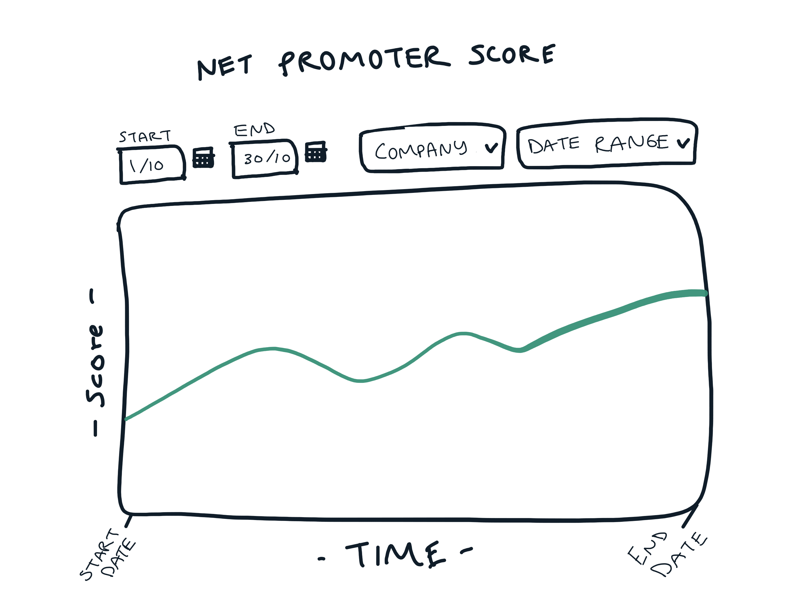

# RateIt technical test

## Introduction

The RateIt technical test is an app using:
- ASP.NET Core 2.1 
- Angular 6 
- Entity Framework backed by SQlite to store data

Candidates are requested to fork the repository, complete the tasks outlined and and submit a pull request when they're finished. The PR will then be reviewed in-person (or via Zoom) along with the rest of the technical interview.

## Requirements

### Overview

RateIt's core business is capturing feedback in the form of ratings from customers, and displaying these to RateIt's clients who can this feedback. The technical test implements a simplified model to represent consumer ratings left for a customer company.

There are two pieces of rating data being captured in this datamodel: a text comment or a Net Promoter Score (NPS). Both are optional (and it's possible that there are ratings that have neither of these data points).

The datamodel is represented in three tables:

1. **Company**  
_Represents the company that is collecting the ratings._
2. **Rating**  
_Represents an individual "rating" performed by a customer._ 
3. **RatingResult**  
_Represents a type of result assigned to the rating. This could be an NPS score or a text comment._  

By default, the application will launch an Angular 6 application with a `router-outlet` to display a component.

Clients like to be able to view the NPS trends, so they can get an idea of how they are tracking over time. These trends might be grouped as a daily, weekly or monthly value.

### Deliverables

The requested deliverables are:

* A chart that displays the NPS trends for a selected company over time
* A user can select company being displayed. This list should be populated from the database
* A user can select the start and end date range of the ratings being displayed
* A user can change the timeframe. The possible values should be Daily, Weekly or Monthly. These represent the "buckets" that ratings are grouped in for the NPS calculation
* Ratings should be grouped according to the Timezone assigned to the Company.

#### UI
Below is a wireframe mockup of how the UI could look. As this is a low fidelity design, there is room for interpretation. You can follow this layout or make adjustments to highlight your UI thinking. (If you don't have time it's fine too). You're welcome to use the available UI components out-of-the box: Bulma, the css framework, and  Highcharts for the chart piece. Most important is that the final UI should be clean and modern with a focus on usability and accessibility. 

### Technical Notes

#### How to calculate NPS

NPS has some maths behind it that you will [need to be across](https://www.surveymonkey.com/mp/net-promoter-score-calculation/) to complete this work.

#### CSS Framework

The test uses [Bulma](https://bulma.io/) as a base CSS framework. Please leverage this framework as much as possible rather than writing new CSS.

#### Highcharts

The test includes the [Highcharts Angular component](https://www.npmjs.com/package/angular-highcharts).

#### Timeframe

You have until your technical interview to complete this work. We realise you're probably working and this needs to fit into your spare time! The test has been designed to take 2-3 evenings of work or approximately 6-8 hours.  Remember to make lots of commits to show us your thinking and your process as you tackle this work. 

You will need to submit your pull request at least two hours before the interview to give us some time to review it. Feel free to reach out to us with any questions about the test. Good luck! 

